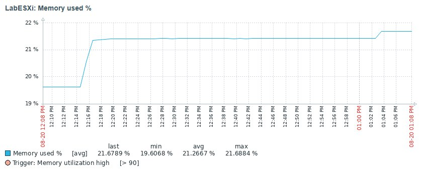

# Zabbix Template — ESXi HP SmartArray

## Description
This Zabbix template is designed for monitoring **HP SmartArray controllers** and **ESXi host resources**.  
It collects metrics via `ssacli`, `ipmi`, and `ssh` commands, and processes them through Zabbix preprocessing.

## Disclaimer

There is a template that works similarly and is on GitHub with all Zabbix templates, but the template works with the old version of Zabbix and ESXi and collected very few metrics, this has been finalized in my template and now you can collect more metrics from physical and virtual servers.

## Compatibility
- Zabbix: 7.2+
- Controllers: HP SmartArray
- OS: ESXi (via `ssacli`, `ipmitool`, `ssh`)

## Metrics

| Name | Key | Type | Units | Description |
|------|-----|------|-------|-------------|
| CPU temperature | esxi.cpu.temp | Dependent | °C | CPU temperature (overall) |
| CPU utilization % | esxi.cpu.util | Dependent | % | CPU utilization percentage (overall) |
| Memory total (MB) | esxi.mem.total_mb | Dependent | MB | Total memory of ESXi host |
| Memory used (MB) | esxi.mem.used_mb | Dependent | MB | Used memory of ESXi host |
| Memory used % | esxi.mem.used_pct | Calculated | % | Memory utilization percentage |
| Controller cache available (GB) | smartarray.controller.cache_avail | Dependent | GB | Available controller cache |
| Controller cache total (GB) | smartarray.controller.cache_total | Dependent | GB | Total controller cache |
| Controller cache used (GB) | smartarray.controller.cache_used | Calculated | GB | Used controller cache |
| Controller cache used % | smartarray.controller.cache_used_pct | Calculated | % | Used controller cache percentage |
| Controller status | smartarray.controller.status | Dependent | - | Controller status |
| Controller temperature | smartarray.controller.temp | Dependent | °C | Controller temperature |
| ESXi Host summary | ssh.run[esxi.host.summary] | SSH | Text | Raw summary of ESXi host |
| ESXi IPMI SDR dump | ssh.run[esxi.ipmi.sdr] | SSH | Text | Raw SDR dump from IPMI |
| SmartArray ssacli dump | ssh.run[smartarray.ssacli.dump] | SSH | Text | Raw SmartArray configuration dump |
| CPU{#CPU} temperature | esxi.cpu.temp[{#CPU}] | Dependent (LLD) | °C | CPU temperature per CPU |
| CPU{#CPU} utilization % | esxi.cpu.util.pkg[{#CPU}] | Dependent (LLD) | % | CPU utilization per CPU |
| LD {#LDLABEL}: free (GB) | smartarray.ld.free[{#LDLABEL}] | Calculated (LLD) | GB | Free space in logical drive |
| LD {#LDLABEL}: size (GB) | smartarray.ld.size[{#LDLABEL}] | Dependent (LLD) | GB | Size of logical drive |
| LD {#LDLABEL}: status | smartarray.ld.status[{#LDLABEL}] | Dependent (LLD) | - | Status of logical drive |
| LD {#LDLABEL}: used (GB) | smartarray.ld.used[{#LDLABEL}] | Dependent (LLD) | GB | Used space of logical drive |
| PD {#PDMODEL} {#PDSN}: capacity (GB) | smartarray.pd.capacity[{#PDSN}] | Dependent (LLD) | GB | Physical disk capacity |
| PD {#PDMODEL} {#PDSN}: status | smartarray.pd.status[{#PDSN}] | Dependent (LLD) | - | Physical disk status |
| PD {#PDMODEL} {#PDSN}: temperature | smartarray.pd.temp[{#PDSN}] | Dependent (LLD) | °C | Physical disk temperature |
| PD {#PDMODEL} {#PDSN}: usage remaining | smartarray.pd.usage[{#PDSN}] | Dependent (LLD) | % | Remaining usage percentage of physical disk |

## Triggers
- CPU utilization high / warning
- Memory utilization high / warning
- CPU temperature high / warning (per CPU)
- Disk temperature high (per physical drive)
- Disk usage remaining low (per physical drive)

## Graphs
- Controller cache usage (pie)
- Controller temperature
- CPU utilization (total)
- Memory used %
- CPU temperature per CPU (LLD prototype)
- Logical drive capacity / used space
- Physical drive capacity, temperature, usage remaining

## Dashboards
The template includes a dashboard with widgets for:  
- Physical Drive Usage Remaining (graph prototype)  
- Physical Drive Temperatures (graph prototype)  

## Macros
- {$CPU_TEMP_HIGH}, {$CPU_TEMP_WARN}
- {$CPU_UTIL_HIGH}, {$CPU_UTIL_WARN}
- {$CTRL_TEMP_HIGH}, {$CTRL_TEMP_WARN}
- {$MEM_UTIL_HIGH}, {$MEM_UTIL_WARN}
- {$PD_TEMP_HIGH}, {$PD_TEMP_WARN}, {$PD_USAGE_LOW}
- {$SSH_USER}, {$SSH_PASSWORD}

## Import Instructions
1. In Zabbix: **Configuration → Templates → Import**  
2. Upload `template.yaml`  
3. Link the template to the desired host  (Don't forget to assign the macros {$SSH_USER} and {$SSH_PASSWORD} to the server)

## Usage examples

### Controller temperature

### CPU utilization (total)

### Disk temperatures

### Disk usage remaining

### 
---
Author: *Dimiqhz*